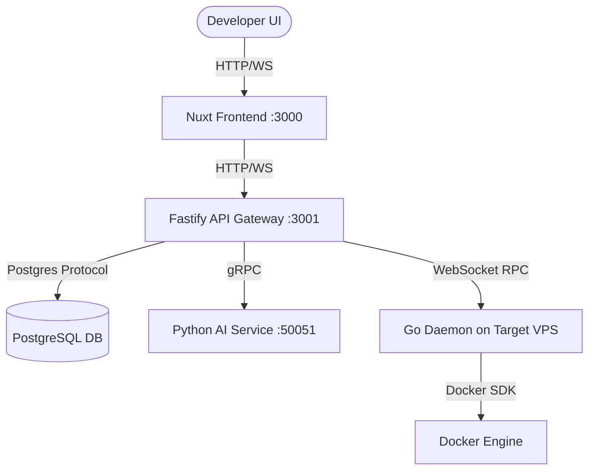

# 🚀 PromptOps PaaS

An AI-driven, multi-VPS Platform-as-a-Service (PaaS) managed through conversational AI agents using the Model Context Protocol (MCP). PromptOps allows developers to register target servers (Linux/Windows), deploy containerized applications via Docker Compose, monitor live system metrics, and run interactive shell sessions—all using natural language.

---

## 🏛️ System Architecture



---

## 📁 Repository Structure

- **[`/control-panel`](file:///C:/Users/ACER/.gemini/antigravity/scratch/ai-devops-paas/control-panel)**: An AI-first dashboard built with Nuxt 4, featuring real-time metric visualization, container management, and a sliding terminal socket powered by `xterm.js`.
- **[`/gateway`](file:///C:/Users/ACER/.gemini/antigravity/scratch/ai-devops-paas/gateway)**: Fastify-based orchestrator, handling database persistence (Drizzle ORM), gRPC-to-REST translation, and session-based execution safety guardrails.
- **[`/ai-service`](file:///C:/Users/ACER/.gemini/antigravity/scratch/ai-devops-paas/ai-service)**: A Python FastAPI gRPC service running a stateful DevOps ReAct agent loop (orchestrated via LangGraph).
- **[`/daemon`](file:///C:/Users/ACER/.gemini/antigravity/scratch/ai-devops-paas/daemon)**: Go daemon installed on remote VPS hosts. Communicates with the gateway via secure WebSockets and operates as an MCP server.
- **[`/shared`](file:///C:/Users/ACER/.gemini/antigravity/scratch/ai-devops-paas/shared)**: Shared protobuf schemas defining gRPC models.

---

## 🛠️ Deployment Instructions

### 📋 Prerequisites
- **Docker** and **Docker Compose** installed on your host server.
- A **Gemini API Key** (for AI agent orchestration).

### ⚡ Option A: Single-Command Docker Deployment (Recommended)

1. Clone this repository to your host server.
2. Create your environment configuration file:
   ```bash
   cp .env.example .env
   ```
3. Open `.env` and set the following parameters:
   - `GEMINI_API_KEY`: Your Gemini API key.
   - `PUBLIC_GATEWAY_URL`: The public IP or domain of your host server (e.g. `http://103.20.10.10:3001`). *Do not use `localhost` if registering remote servers.*
   - `PUBLIC_WS_URL`: The WebSocket connection URL (e.g. `ws://103.20.10.10:3001`).
4. Launch the platform:
   ```bash
   docker compose up -d --build
   ```

After execution, the following routes will be accessible:
- **Web Console Dashboard**: `http://<your_server_ip>:3000`
- **REST / WS API Gateway**: `http://<your_server_ip>:3001`

---

## 🖥️ Onboarding Target VPS Nodes

To connect your VPS targets to the orchestrator:
1. Log in to the Web Dashboard (`http://<your_server_ip>:3000`).
2. Click the **"Add VPS"** button in the sidebar.
3. Enter a name (e.g. `prod-web-vps`) and select your target OS.
4. Click **"Generate Token"** and copy the one-liner command:
   - **Linux VPS**:
     ```bash
     curl -sSL "http://<your_server_ip>:3001/install.sh?token=<token>&name=prod-web-vps" | bash
     ```
   - **Windows VPS**:
     ```powershell
     irm "http://<your_server_ip>:3001/install.ps1?token=<token>&name=prod-web-vps" | iex
     ```
5. Run the copied command in the target server's terminal. The installer will download the compiled client binary, set up execution paths, launch the background process, and establish a WebSocket tunnel back to the gateway.

---

## 🤖 How to Use (Conversational DevOps)

PromptOps is fully interactive. Once a target VPS is online, you can use the chat interface to query system states and trigger modifications:

### 📊 Monitoring & Resource Stats
- **Query metrics**: *"How are my system stats looking?"*
  - *Returns live CPU, Memory, and Disk usage with real-value formatting.*
- **List Docker containers**: *"Are all containers running on prod-web-vps?"*
  - *Shows running and exited containers on the node, including their individual resource consumption (e.g., `0.30% CPU`, `138.9MiB / 15.47GiB RAM`).*

### 🚢 Container Orchestration & Deployments
- **Run applications**: *"Deploy a pgAdmin instance on port 5050 and set PGADMIN_DEFAULT_EMAIL to admin@admin.com"*
  - *The AI agent will generate a Docker Compose YAML, write it to `/var/promptops/apps/`, and execute it via the daemon.*
- **Control containers**: *"Restart my database container"* or *"Stop promptops-ai-service"*
  - *Docks straight into the Docker SDK via the daemon WebSocket.*

### 🛡️ Safety Guardrails & Auto-Approvals
- **Safety Interceptor**: Destructive commands (e.g. `rm -rf /` or container pruning) are intercepted by the Gateway and require manual user authorization.
- **Always-Approve Mode**: Toggle the "Always Approve" switch in the chat drawer to let the agent auto-execute non-destructive tasks without prompting for approval.
- **Terminal Shell Integration**: Slide up the terminal drawer to trigger a direct Web TTY socket straight to the target server's shell.
